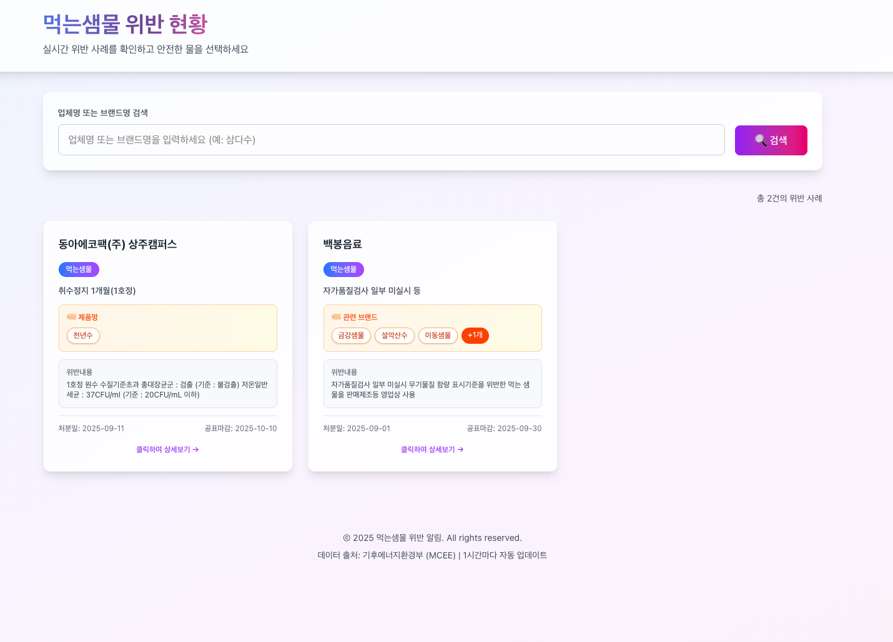
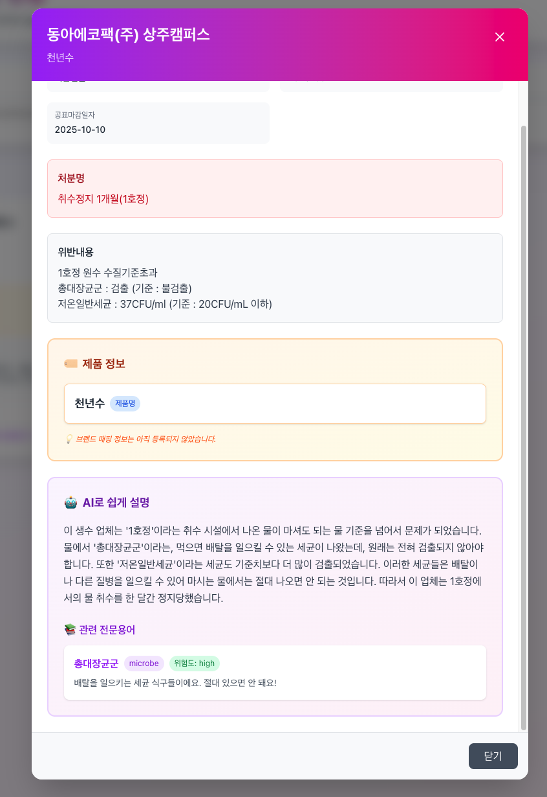
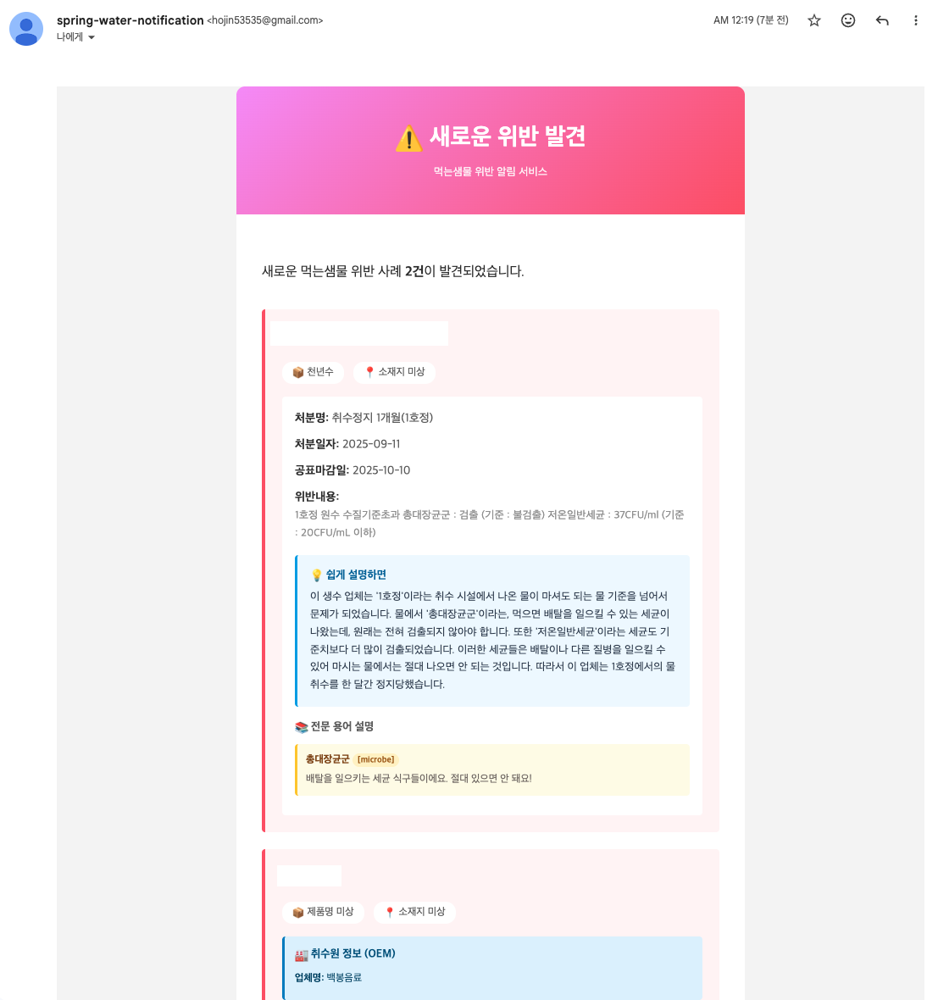
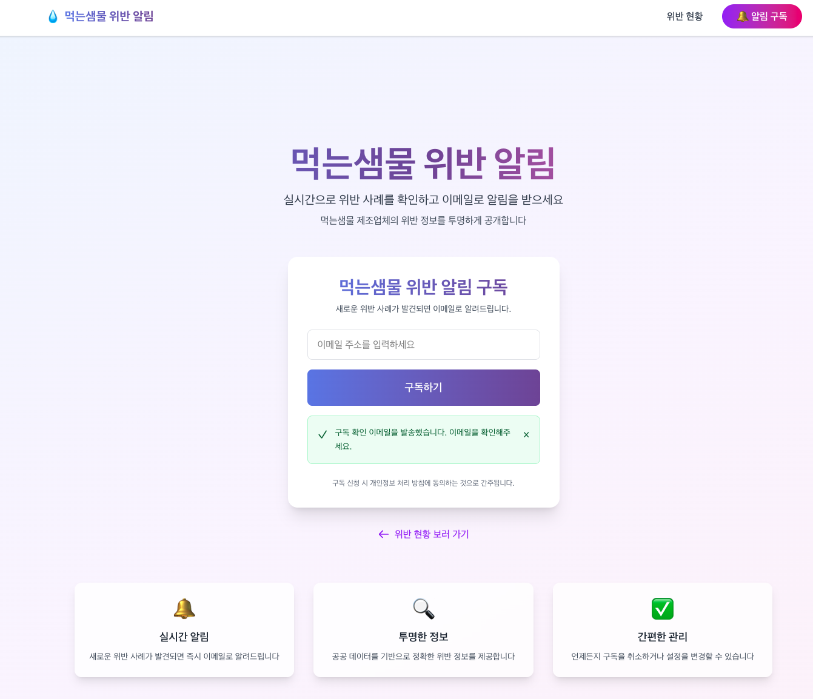

# 먹는샘물 안심 알리미 - 이메일 구독 서비스

## 💧 먹는샘물 안심 알리미

본 프로젝트는 파편화된 수질 위반 데이터를 수집 및 가공하여, 소비자가 상표명만으로도 제조사의 위반 이력과 수원지의 안전성을 즉각 확인할 수 있는 환경을 구축하는 것을 목표로 합니다.

## 📌 프로젝트 배경

### 생수 시장의 정보 비대칭성과 안전 불감증<br/>

높은 부적합률: 최근 6년간(2021년기준) 국내 먹는샘물 제조업체 61곳 중 절반에 가까운 28곳(46%)이 수질 기준 부적합 판정을 받았습니다.

### OEM의 함정

소비자에게 친숙한 대기업 브랜드 및 유통사 PB(쿠팡 탐사수, 이마트 피코크 등) 제품 상당수가 수질 위반 이력이 있는 업체에서 생산됩니다.

### 정보 접근성 제한

환경부의 행정처분 공고는 기간이 짧고(4개월), 제조업체명만 공개되어 소비자가 실시간으로 브랜드의 안전성을 확인하기 매우 어렵습니다.

<p align="left"> <a href="https://www.youtube.com/watch?v=mglxbnccbeo">  </a> <a href="https://github.com/hojin535/Spring-water-notification-crawling">  </a> </p>

## ✨ 주요 기능

- 📧 **이메일 구독**: 간편한 이메일 입력으로 먹는샘물 위반 알림을 구독합니다.
- ✅ **안전한 구독 확인**: 이메일로 전송된 확인 링크를 통해 안전하게 구독을 인증합니다.
- 🔔 **실시간 위반 알림**: 새로운 위반 사례가 발견되면(15분 주기) 즉시 이메일로 알림을 보냅니다.
- 📖 **전문용어 해설**: 어려운 검사 항목 용어를 AI를 통해 알기 쉽게 번역하여 제공합니다.
- 🗺️ **취수원-브랜드 연동**: 환경부 데이터를 기반으로 어떤 브랜드의 샘물이 문제인지 명확히 알려줍니다.
- 🎨 **모던한 UI**: 그라데이션과 애니메이션을 활용한 세련된 디자인을 제공합니다.
- 📱 **반응형 디자인**: 모바일, 태블릿, 데스크톱 등 모든 기기에서 최적화된 화면을 지원합니다.

## 🖥️ 화면 구성

|                              메인 화면                              |                         구독 확인 모달                         |
| :-----------------------------------------------------------------: | :------------------------------------------------------------: |
|  |  |

|                          이메일 알림                           |                               구독 페이지                               |
| :------------------------------------------------------------: | :---------------------------------------------------------------------: |
|  |  |

### 🏗️ 시스템 아키텍처


## 🛠️ 기술 스택

- **프레임워크**: Next.js 14(App Router)
- **언어**: TypeScript
- **스타일링**: Tailwind CSS
- **상태 관리**: React Hooks
- **백엔드**: FastAPI (Python)
- **메일링**: Google SMTP

## 📝 사용 방법

1.  **구독 신청**: 메인 페이지에서 이메일 주소를 입력하고 "구독하기" 버튼을 클릭합니다.
2.  **구독 확인**: 입력한 이메일로 발송된 확인 링크를 클릭하면 구독이 활성화됩니다. 3초 후 메인 페이지로 자동 이동합니다.
3.  **구독 취소**: 알림 이메일에 포함된 "구독 취소" 링크를 클릭하여 언제든지 구독을 취소할 수 있습니다.

## 📁 프로젝트 구조

```
.
├── app/                              # Next.js App Router
│   ├── layout.tsx                    # 루트 레이아웃
│   ├── page.tsx                      # 메인 페이지
│   ├── globals.css                   # 전역 스타일
│   ├── subscribe/
│   │   └── confirm/[token]/          # 구독 확인 페이지
│   └── unsubscribe/[token]/          # 구독 취소 페이지
├── components/                       # React 컴포넌트
│   ├── EmailSubscriptionForm.tsx     # 이메일 구독 폼
│   └── ui/                           # 재사용 가능한 UI 컴포넌트
│       ├── Button.tsx
│       ├── Input.tsx
│       └── Alert.tsx
├── lib/
│   └── api.ts                        # API 호출 함수
└── types/
    └── api.ts                        # TypeScript 타입 정의
```
